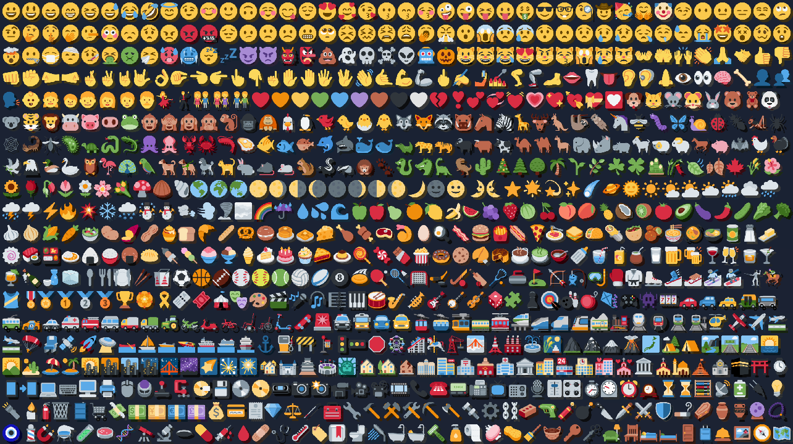

# Andro's Discord Emojis

Since snapshot [20w17a](https://www.minecraft.net/de-de/article/minecraft-snapshot-20w17a) (pre 1.16) Minecraft is supporting full Unicode range allowing the use of emojis in all places like chat, books and signs. Sadly Minecraft's own font didn't get an update so I did it myself with this [resource pack](https://minecraft.gamepedia.com/Resource_Pack#Fonts).

## Usage

I recommend using an online tool like [Twitter Symbols](https://www.piliapp.com/twitter-symbols/) to copy/paste emojis into Minecraft.

## Limitations

* Requires Minecraft 1.16+
* Emojis need white font color:
  * They are displayed complete black on signs by default. Because Minecraft's "white" dye isn't really white emojis still look dark after dyeing. In single player mode use a mod like [Color Unchained](https://www.curseforge.com/minecraft/mc-mods/color-unchained) to get real white. On a server you often depend on a plugin like [EssentialsX](https://essentialsx.net/) to allow the usage of color codes (`&f` for white).
  * To change font color in a book copy and paste `§f` into the book followed by an emoji. After that copy/paste `§0` to get black again otherwise the normal font could be a bit hard to read.
* Not all emojis are supported:
  * While Minecraft has full Unicode support now, resource packs do not. At the time of writing (1.16.2 rc1 is out) they still lack support for so called supplementary characters. To make it short, some emojis are combined ones, for example 🙅🏻 is a combination of 🙅 (same emoji with default skin color) and 🏻 (white skin tone). Currently each part is interpreted separately resulting in some emoji shreds.
  * I added [a version with all emojis](https://github.com/Androkai/AndrosDiscordEmojis/tree/all-emojis) on another branch, ready for future updates. 😅
* Client side "Force Unicode" setting will prevent the emojis from being displayed since this will switch to the deprecated font system that does not support full unicode range and so no emojis.

## License

* The emoji images in this project are used from [Twemoji](https://twemoji.twitter.com/) which are licensed by [CC BY 4.0](https://creativecommons.org/licenses/by/4.0/).
* This project is also licensed by [CC BY 4.0](https://creativecommons.org/licenses/by/4.0/). Feel free to use and adapt in your own resource pack but give appropriate credit and provide a link to the license.

## Screenshots

